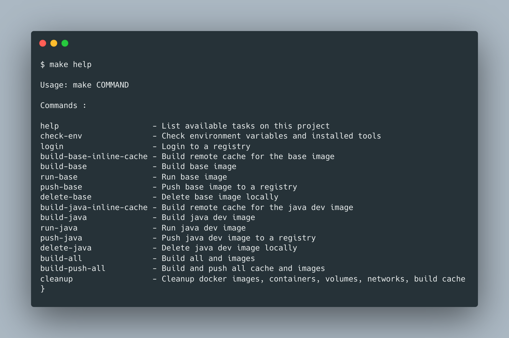
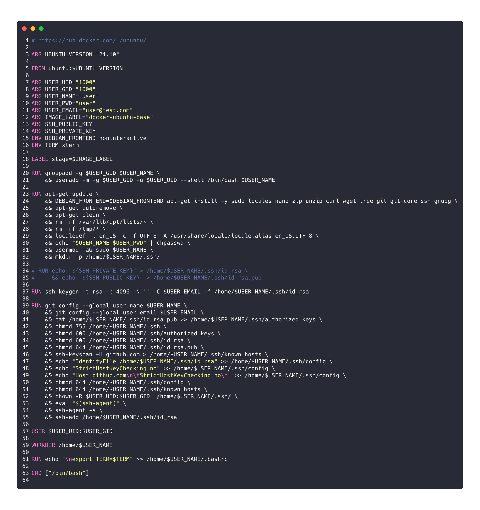
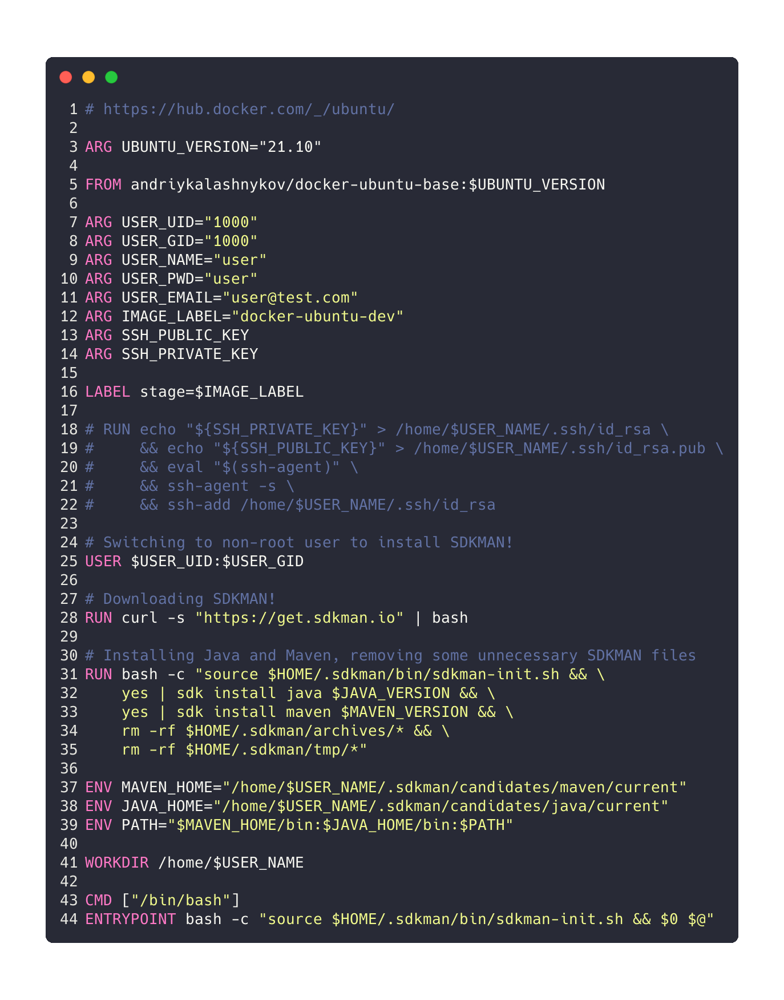

[](https://github.com/AndriyKalashnykov/docker-ubuntu/actions/workflows/main.yml)
[](https://hits.seeyoufarm.com)
[](https://opensource.org/licenses/MIT)
# Ubuntu Development environment (Java and Go Docker images)

## Help




## Pre-Requisites

* [Docker](https://docs.docker.com/get-docker/)

* Set DockerHub login and password
  
    ```bash
    #!/bin/bash
    
    DOCKER_LOGIN= 
    DOCKER_PWD=
## Ubuntu base docker image with additional packages

<!--  -->
```bash
make build-base
make run-base
```

## Java dev environment docker image off of Ubuntu base image

<!--  -->
```bash
make build-java
make run-java
```
