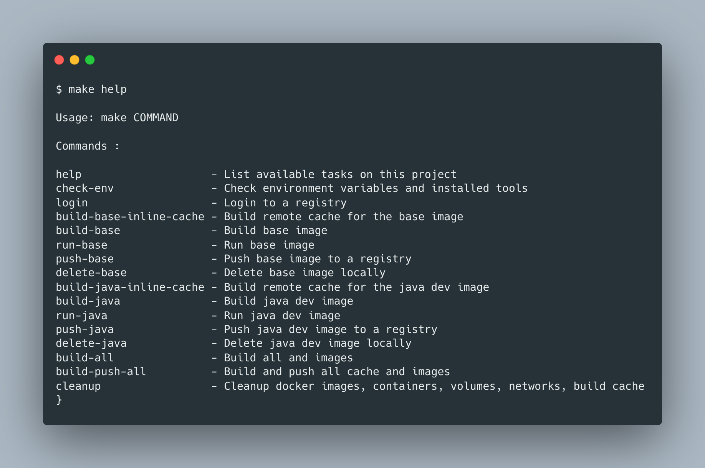

[](https://github.com/AndriyKalashnykov/docker-ubuntu/actions/workflows/main.yml)
[](https://hits.sh/github.com/AndriyKalashnykov/docker-ubuntu/)
[](https://opensource.org/licenses/MIT)
[](https://app.renovatebot.com/dashboard#github/AndriyKalashnykov/docker-ubuntu)

# Ubuntu Dev-Container Images — Reproducible DevOps Toolchain

A layered set of Ubuntu-based development-environment Docker images. A common
**base** image ships a broad cloud-native / DevOps toolchain (kubectl, helm,
kustomize, k9s, kind, flux, conftest, opa, Docker-in-Docker, …); the **java**
and **go** variants build on it with their respective language stacks. Every
tool version is pinned and reproducible via **mise** — see [TOOLING.md](./TOOLING.md).

Images are hadolint-linted, Trivy-scanned (filesystem + image), cosign
keyless-signed with SBOM attestation, and published to GHCR through a
Renovate-managed GitHub Actions pipeline.



## Image hierarchy

```text
ubuntu:26.04 (LTS)
  └─ docker-ubuntu-base   base + DevOps toolchain (mise-managed) + Docker-in-Docker
       ├─ docker-ubuntu-java   + Java 25 LTS / Maven / Gradle
       └─ docker-ubuntu-go     + Go toolchain & dev CLIs, kubebuilder, goreleaser,
                                 GPG, PostgreSQL
```

The `java` and `go` images are built `FROM ghcr.io/andriykalashnykov/docker-ubuntu-base`,
so `make build-java` / `make build-go` depend on `make build-base`.

## Tooling & versions

All CLI tools are managed by **[mise](https://mise.jdx.dev)** and pinned in
per-image `.mise.toml` files (`base/.mise.toml`, `java/.mise.toml`,
`go/.mise.toml`); the base OS (tag + digest) and mise itself are pinned via
Dockerfile `ARG`s. Everything is kept current automatically by Renovate.
The full strategy and the list of what is/ isn't mise-managed is documented in
**[TOOLING.md](./TOOLING.md)**.

## Prerequisites

| Requirement | Notes |
|-------------|-------|
| [Docker](https://docs.docker.com/get-docker/) with BuildKit | `DOCKER_BUILDKIT=1` |
| GNU Make | drives all build/run/push targets |
| `GITHUB_PAT` (write:packages) | only for `make login` / `push-*` to GHCR |

**All three images build with no host secrets** — the filesystem is credential-free.
For the **go** image, the operator's credentials are injected **at container start**
by `make run-go` (never baked into the image): the SSH key pair at
`~/.ssh/id_rsa{,.pub}`, the GPG key pair at
`${DOTFILES_DIR}/gnupg/AndriyKalashnykov-secret-gpg.key` + `…-ownertrust-gpg.txt`
(`DOTFILES_DIR` defaults to `~/projects/dotfiles`), and the `GITHUB_PAT` /
`MY_GPG_PASSWORD` env vars — each used only if present (otherwise a fresh SSH key is
generated and GPG/PAT setup is skipped). These paths are owner-specific.

```bash
export GITHUB_PAT=<github-pat-with-write:packages>   # for `make login` / push to GHCR
```

## Quick start

### Build and run the images locally

```bash
make build-base && make run-base      # base image
make build-java && make run-java      # java dev image
make build-go   && make run-go        # go dev image
```

`run-*` drops you into an interactive `bash` shell with the full toolchain on
`PATH` (and `JAVA_HOME` / `GOROOT` set by the entrypoint). `run-go` additionally
bind-mounts the host Docker socket (Docker-out-of-Docker) and the current directory.

### Run a published image (no build needed)

The `base` and `java` images are published to GHCR — pull and run directly:

```bash
docker run -it --rm ghcr.io/andriykalashnykov/docker-ubuntu-base:26.04 bash
docker run -it --rm ghcr.io/andriykalashnykov/docker-ubuntu-java:26.04 bash
```

### Build a Java or Go app inside the container

Mount your project and run the toolchain. The entrypoint activates mise, so
`java`/`mvn`/`gradle`/`go` and `JAVA_HOME`/`GOROOT` are ready:

```bash
# Java (image ships Java 25 LTS, Maven 3.9, Gradle 9)
docker run --rm -it -v "$PWD":/home/user/app -w /home/user/app \
  ghcr.io/andriykalashnykov/docker-ubuntu-java:26.04 mvn -B package
docker run --rm -it -v "$PWD":/home/user/app -w /home/user/app \
  ghcr.io/andriykalashnykov/docker-ubuntu-java:26.04 gradle build

# Go (image ships Go 1.26 + dlv, goreleaser, swag, goose, …) — build go locally first
make build-go
docker run --rm -it -v "$PWD":/home/user/app -w /home/user/app \
  ghcr.io/andriykalashnykov/docker-ubuntu-go:26.04 go build ./...
docker run --rm -it -v "$PWD":/home/user/app -w /home/user/app \
  ghcr.io/andriykalashnykov/docker-ubuntu-go:26.04 go test ./...

# …or open an interactive shell with your project mounted and work normally:
docker run --rm -it -v "$PWD":/home/user/app -w /home/user/app \
  ghcr.io/andriykalashnykov/docker-ubuntu-java:26.04 bash
```

> The **go** image is built locally only (`make build-go`) — it is not published
> to GHCR because it can carry operator credentials, so build it before running it.

## Make targets

Run `make help` for the authoritative list.

| Target | Description |
|--------|-------------|
| `help` | List available targets |
| `check-env` | Check required env vars and installed tools |
| `login` | Log in to GHCR (GITHUB_PAT via `--password-stdin`) |
| `lint` | Lint all Dockerfiles with hadolint |
| `ci` | Run local CI checks (lint + build-base) |
| `renovate-validate` | Validate `renovate.json` against the Renovate schema |
| `build-base` / `run-base` / `push-base` / `delete-base` | Base image lifecycle |
| `build-java` / `run-java` / `push-java` / `delete-java` | Java image lifecycle |
| `build-go` / `run-go` / `delete-go` | Go image lifecycle (built locally only) |
| `push-go` | Push go image — **blocked unless `ALLOW_GO_PUSH=1`** (local-only by policy; the image is credential-free) |
| `build-base-inline-cache` / `build-java-inline-cache` | Build & push the registry inline cache |
| `build-all` | Build base + go + java |
| `build-push-all` | Build & push the **publishable** images (base + java; go excluded) |
| `cleanup` | Remove all images/layers/containers/volumes and prune build cache |

## Environment variables

| Variable | Purpose |
|----------|---------|
| `GITHUB_PAT` | GHCR auth (write:packages) for `login`/`push-*`; also injected into the **go** image `.netrc` at run time |
| `MY_GPG_PASSWORD` | GPG key passphrase for the **go** image (passed to `make run-go` at run time) |
| `DOTFILES_DIR` | Override the dotfiles path (default `~/projects/dotfiles`) |
| `DOCKER_REGISTRY` | Override the publish registry (default `ghcr.io`) |

## CI/CD

- **`CI`** ([`main.yml`](./.github/workflows/main.yml)) — builds, scans, signs and
  publishes the **base + java** images to GHCR. Pipeline: `changes`
  (paths-filter) → `static-check` (hadolint + Trivy filesystem scan) → `build`
  (build → Trivy image scan → tag-gated push (`:26.04` + `:latest` + `:sha-…`) →
  cosign keyless signing by digest → SBOM generation) → `ci-pass` (single required
  status check). PRs build and scan but do not push/sign. The **go** image is
  built locally only (a personal dev container; local-only by policy).
- **Cleanup runs** ([`cleanup-runs.yml`](./.github/workflows/cleanup-runs.yml))
  — weekly prune of old workflow runs via the `gh` CLI.

Dependency updates are handled by **Renovate** (`renovate.json`): the Ubuntu base
tag (+ pinned digest), GitHub Action SHAs, the mise `ARG`, and every mise-pinned tool.

### Verify a published image signature

Images are signed keyless via cosign (Sigstore OIDC). Verify with:

```bash
cosign verify ghcr.io/andriykalashnykov/docker-ubuntu-base:26.04 \
  --certificate-identity-regexp 'https://github.com/AndriyKalashnykov/docker-ubuntu/.github/workflows/main.yml@refs/.*' \
  --certificate-oidc-issuer https://token.actions.githubusercontent.com
```

## License

[MIT](./LICENSE)
